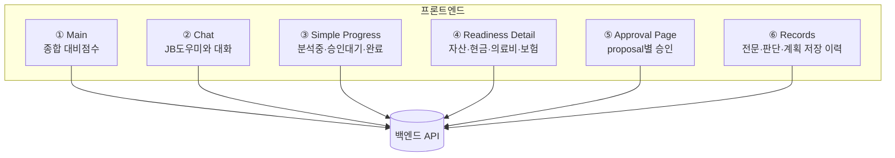
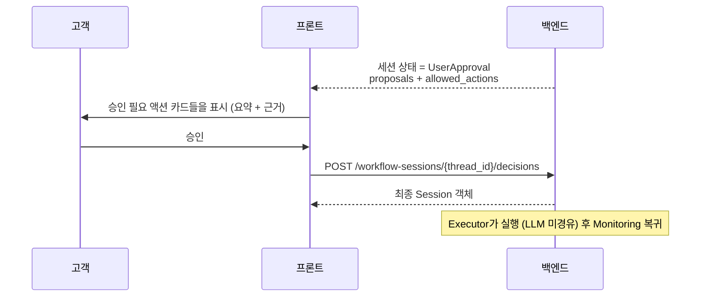

# JB WM — Frontend

> **JB WM Agent** 프론트엔드. 건강·자산을 하나의 **회복탄력성 상태**로 보는 능동형 lifelong WM 에이전트의 **고객 대면 인터페이스**입니다.

React 기반 워크스페이스로, 고객(주 타깃: 고령층)이 자신의 **회복탄력성 상태**(건강+자산 통합)와 에이전트의 판단·제안을 보고, 민감한 액션을 **승인/거절/수정**하는 화면을 제공합니다. 백엔드 상태를 렌더링하고 의도를 제출할 뿐, 비즈니스 결정이나 에이전트 권한을 소유하지 않습니다.

> 제품 개념의 정본은 백엔드 [`docs/01_PRODUCT_CONTEXT.md`](../JB-WM-backend/docs/01_PRODUCT_CONTEXT.md). 핵심: 건강·자산 통합 / 자산 변동 선제 감지 / 지불의향 개인화 / 의료 권고는 생성하지 않음(재무·통계참고·연결만).

---

## 핵심 화면

챗 UI가 본질이 아닙니다. 첫 화면의 목적은 고객이 들어오자마자
**내가 지금 얼마나 준비되어 있는지**를 이해하고 안심하는 것입니다.



### ① Main

메인에서는 기존의 `통합 필요도`, `금융 컨텍스트`, `상황 시뮬레이션`을 노출하지 않습니다.
고객에게는 내부 판단 항목보다 “현재 대비가 충분한가”가 먼저 보이도록 합니다.

```
나의 종합 대비 상태:
- 앞으로의 건강·자산 변화 대비율
- 현금 여유 / 의료 대비 / 보험 상태 요약
- JB도우미와 대화
- 고객용 진행 상태
- 도우미 제안 목록
```

### ② Chat

고객 입력은 카카오톡 친구와 대화하는 느낌의 채팅 화면에서 받습니다. 빠른 선택
버튼은 채팅창 위에 노출되지만, 본질은 버튼형 폼이 아니라 대화입니다.

선택 또는 입력 결과는 `/workflow-sessions/{thread_id}/messages`로 전달합니다.
고객 프론트는 operator 전용 event trigger API를 호출하지 않습니다.

### ③ Simple Progress

고객에게 내부 LangGraph node를 그대로 보여주지 않고 다음 3단계로 단순화합니다.

```text
고객님의 응답 분석중 ─ 승인 대기 ─ 실행 및 기록 완료
```

세션과 records는 polling으로 갱신하므로 operator 화면에서 이벤트를 발생시켜 제안이
생기면 고객 화면에도 새로고침 없이 표시됩니다.

### ④ Readiness Detail

```
보유자산 / 현금유동성 / 의료비 대비 / 보험 대비 / 악화 시 추가 부담
```
이 화면의 점수는 고객 이해를 돕는 참고 지표입니다. 최종 agent 판단은 백엔드
workflow와 agent job 결과를 따른다. 원천값은 `자세히 보기`에서 확인합니다.

### ⑤ Approval Page

승인이 필요한 제안은 메인에서 바로 실행하지 않고 `/approvals`에서 크게 보여줍니다.

```
승인 / 거절 / 나중에
```
`나중에`는 결정을 보내지 않고 메인으로 돌아갑니다. 제안 목록에서 다시 승인 화면으로
들어갈 수 있습니다.

### ⑥ Records

진행 내역과 저장된 대화·판단·계획 전문은 보조 화면에서 확인합니다.

---

## 승인 흐름 (프론트 관점)



프론트는 **유효 전이를 독자 판단하지 않습니다.** 백엔드 응답의 `allowed_actions`만 렌더링합니다.

---

## 기술 스택

| Layer           | Library / Tool                     |
| --------------- | ---------------------------------- |
| Framework       | React 19 + TypeScript              |
| Bundler         | Vite                               |
| Styling         | Tailwind CSS (JB brand tokens)     |
| UI              | 자체 컴포넌트 (Tailwind utility)   |
| Routing         | React Router (`/login`, `/main`, `/records`) |
| Server state    | TanStack Query                     |
| Local UI state  | React `useState`                   |
| Forms           | 현재 없음                          |
| Tables / Charts | 현재 없음                          |
| i18n            | `src/i18n.ts` 최소 dict            |
| Package manager | pnpm                               |

### Planned / Not Installed

아래 라이브러리는 README 초안의 계획에는 있었지만 현재 `package.json`에는 없습니다.
도입 전까지 구현/문서에서 실제 의존성처럼 취급하지 않습니다.

- Zustand
- shadcn/ui
- React Hook Form / Zod
- TanStack Table
- Recharts
- react-i18next

---

## 고령층 UX 원칙 (차별점)

주 타깃이 고령층이므로 다음이 **핵심 차별점**입니다 (평가 5.1):

- 큰 글씨 / 높은 대비 / 넉넉한 터치 영역
- 쉬운 용어 (전문 금융/의료 용어 풀어쓰기)
- 명확한 proposal별 승인 (한 카드가 한 실행 단위)
- 분석중·승인대기·완료로 단순화한 진행 상태
- (확장) 음성 입력·읽어주기

---

## 주요 라우트

현재는 React Router로 페이지를 나눕니다.

| 화면 | 용도 |
|---|---|
| `/login` | mock 고객 선택 로그인 |
| `/main` | 종합 대비점수, JB도우미 채팅, 고객용 진행 상태, 도우미 제안 목록 |
| `/readiness` | 자산·현금유동성·의료비·보험·악화 대비 상세 |
| `/approvals` | 승인 필요한 제안을 크게 확인하고 승인/거절/나중에 선택 |
| `/records` | 저장된 판단 기록/전문/계획 전체 보기 |

루트(`/`)는 `/main`으로 보냅니다. 로그인되지 않은 상태에서 `/main` 또는 `/records`에 접근하면 `/login`으로 보냅니다.

---

## 상태 관리 정책

- **서버 상태 = TanStack Query** (세션 상태, proposal, 이벤트, 도메인 데이터)
- **로컬 UI 상태 = React `useState`** (현재 session id 등)
- **Zustand = planned** (사이드바, 탭 등 복잡한 UI 상태가 생길 때만)
- 백엔드에서 파생 가능한 데이터를 Zustand에 중복 저장하지 않음

---

## i18n

- 기본 `ko`. 현재는 `src/i18n.ts`의 최소 `t()` (ko dict). en은 dict만 추가하면 동작 (구조 대비).
- 문자열 하드코딩 금지 — `t("...")` 사용.
- 규모가 커지면 `react-i18next`로 확장.

---

## 개발

전제: Node LTS(nvm) + pnpm. 시스템에 pnpm이 없으면 한 번만:
```bash
corepack enable && corepack prepare pnpm@latest --activate
```

**clone 후 그대로 실행** (프로젝트는 이미 스캐폴드되어 있음):
```bash
pnpm install      # package.json/pnpm-lock.yaml 기준 의존성 설치
pnpm dev          # http://localhost:5173
pnpm build        # 프로덕션 빌드 (tsc + vite)
```

> 프론트는 백엔드 API(:8000)를 호출합니다. **백엔드를 먼저 띄우세요**:
> `cd ../JB-WM-backend && source .venv/bin/activate && uvicorn app.main:app --reload`
> (백엔드 셋업·실행은 ../JB-WM-backend의 `docs/SETUP.md`, `docs/RUNBOOK.md` 참고)
>
> API 주소는 `VITE_API_BASE` 환경변수로 바꿀 수 있어요 (기본 `http://localhost:8000`).

---

## 디자인

JB금융그룹 공식 사이트에서 추출한 브랜드 토큰을 사용합니다.

- `tailwind.config.ts` — 색상·타이포·레이아웃 토큰 (커밋됨)
- `docs/JB_BRAND_DESIGN.md` — 전체 디자인 레퍼런스 (커밋됨)

주요 토큰: Primary `#0A31A8`, Accent `#1C56FF`, 본문 `#333333`, 폰트 SUIT Variable.
