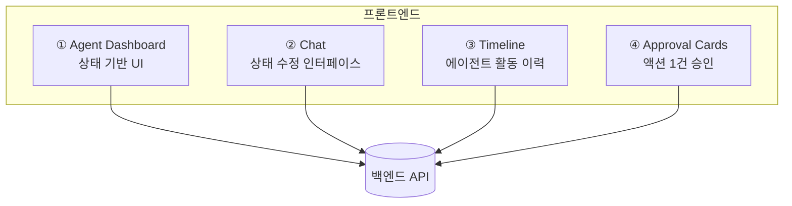
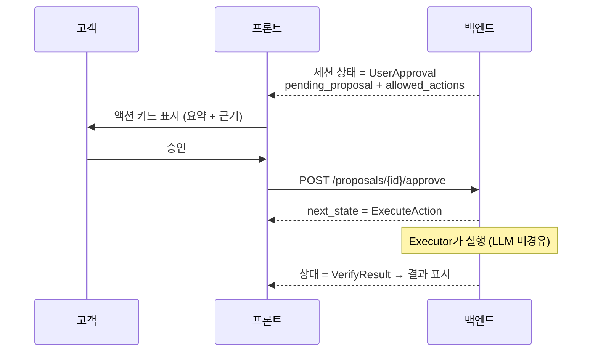

# JB WM — Frontend

> **JB WM Agent** 프론트엔드. 능동형 Life Event Agent의 **고객 대면 인터페이스**입니다.

React 기반 워크스페이스로, 고객(주 타깃: 고령층)이 에이전트의 관찰·판단·제안을 보고, 민감한 액션을 **승인/거절/수정**하는 화면을 제공합니다. 백엔드 상태를 렌더링하고 고객 의도를 제출할 뿐, 비즈니스 결정이나 에이전트 권한을 소유하지 않습니다.

백엔드 설계는 [`../JB-WM-backend`](../JB-WM-backend) 참고.

---

## 핵심 화면

챗 UI가 본질이 아닙니다. 본질은 **고객의 현재 상태를 시각화**하는 것입니다.



### ① Agent Dashboard (상태 기반)
```
현재 상태:
- 건강 리스크: 상승
- 현금흐름 위험: 중간
- 보험 공백: 존재
- 투자 위험도: 과다

Agent 권장 액션:
[검진 예약]  [보험 보장 분석]  [현금흐름 플랜 생성]
```

### ② Chat (상태 수정 인터페이스)
```
고객: 보험만 먼저 확인해줘
Agent: 현재 실손보험으로 일부 보장되지만, 심혈관 특약은 없습니다.
        추가 플랜을 생성할까요?
```
챗은 "대화 잘하는 봇"이 아니라 **고객 의도를 상태로 바꾸는** 입력 수단입니다.

### ③ Timeline (에이전트 느낌의 핵심)
```
5/21 건강 이상 신호 감지
5/21 보험 공백 분석 완료
5/22 고객 승인 대기
5/22 보험 분석 리포트 생성
```

### ④ Approval Cards
- 외부 효과가 있는 액션(예약·청구·가입·송금·포트폴리오 변경)은 **그 액션 1건에 대해서만** 승인.
- 승인/거절/수정 버튼. 백엔드가 유효 행동을 내려주고, 프론트는 그것만 노출.

---

## 승인 흐름 (프론트 관점)



프론트는 **유효 전이를 독자 판단하지 않습니다.** 백엔드 응답의 `allowed_actions`만 렌더링합니다.

---

## 기술 스택

| 레이어 | 기술 |
|---|---|
| 프레임워크 | React 19 + TypeScript |
| 번들러 | Vite |
| 스타일 | Tailwind CSS (JB 브랜드 토큰 — `tailwind.config.ts`) |
| UI | shadcn/ui |
| 라우팅 | React Router v7 |
| 서버 상태 | TanStack Query |
| 로컬 UI 상태 | Zustand (필요 시) |
| 폼 | React Hook Form + Zod |
| 테이블/차트 | TanStack Table · Recharts |
| i18n | react-i18next (ko 우선, en 대비) |
| 패키지 | pnpm |

---

## 고령층 UX 원칙 (차별점)

주 타깃이 고령층이므로 다음이 **핵심 차별점**입니다 (평가 5.1):

- 큰 글씨 / 높은 대비 / 넉넉한 터치 영역
- 쉬운 용어 (전문 금융/의료 용어 풀어쓰기)
- 명확한 단일 액션 승인 (한 번에 하나)
- 진행 상황의 시각적 타임라인
- (확장) 음성 입력·읽어주기

---

## 주요 라우트

| 라우트 | 용도 |
|---|---|
| `/` | 진입 / 대시보드 |
| `/dashboard` | 상태 기반 메인 |
| `/timeline` | 에이전트 활동 이력 |
| `/chat` | 의도 입력/수정 |
| `/proposals/:id` | 액션 승인 상세 |
| `/settings` | 선호/제약(개인화) · 언어 |

---

## 상태 관리 정책

- **서버 상태 = TanStack Query** (세션 상태, proposal, 이벤트, 도메인 데이터)
- **로컬 UI 상태 = Zustand** (사이드바, 탭 등, 필요할 때만)
- 백엔드에서 파생 가능한 데이터를 Zustand에 중복 저장하지 않음

---

## i18n

- 기본 `ko`, 구조는 ko/en 대비 (`react-i18next`)
- 문자열 하드코딩 금지 — `t("...")` 사용. en은 번역 파일만 추가하면 동작
- 언어 토글은 JB 사이트 패턴 (헤더 `ko / en`)

---

## 개발

```bash
# 시스템 도구 (백엔드 SETUP과 공유): nvm + Node LTS
corepack enable && corepack prepare pnpm@latest --activate

# 프로젝트 초기화 (최초 1회)
pnpm create vite . --template react-ts
pnpm install
pnpm add react-router-dom @tanstack/react-query zustand react-hook-form zod
pnpm add react-i18next i18next i18next-browser-languagedetector
pnpm add -D tailwindcss @tailwindcss/vite @biomejs/biome vitest @testing-library/react

# 실행
pnpm dev      # 개발 서버
pnpm build    # 프로덕션 빌드
pnpm lint     # Biome
pnpm test     # Vitest
```

---

## 디자인

JB금융그룹 공식 사이트에서 추출한 브랜드 토큰을 사용합니다.

- `tailwind.config.ts` — 색상·타이포·레이아웃 토큰 (커밋됨)
- `docs/JB_BRAND_DESIGN.md` — 전체 디자인 레퍼런스 (**gitignore** — JB 사이트 추출물)

주요 토큰: Primary `#0A31A8`, Accent `#1C56FF`, 본문 `#333333`, 폰트 SUIT Variable.
