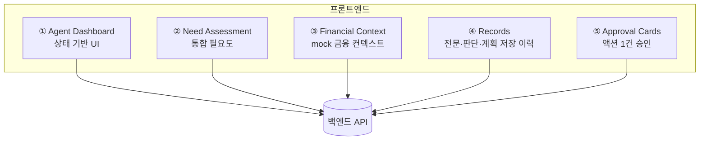
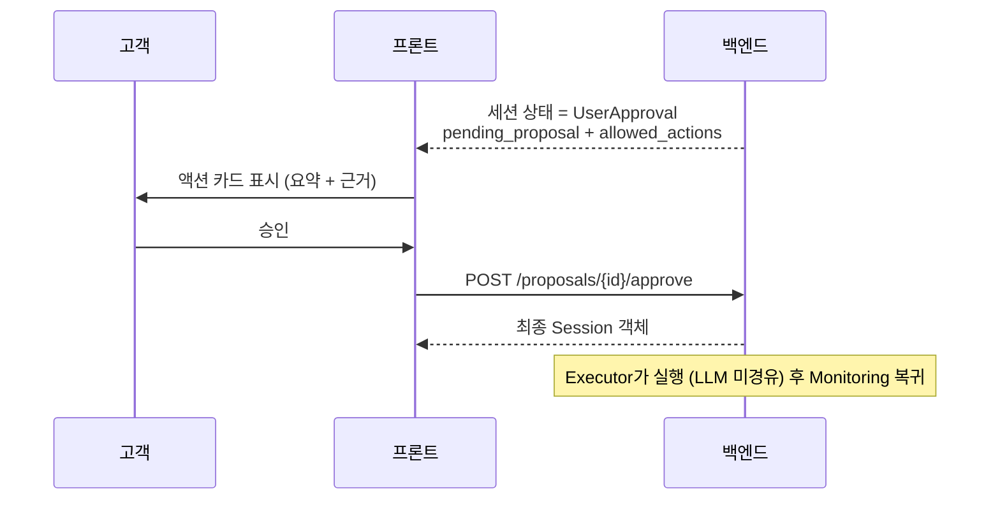

# JB WM — Frontend

> **JB WM Agent** 프론트엔드. 건강·자산을 하나의 **회복탄력성 상태**로 보는 능동형 lifelong WM 에이전트의 **고객 대면 인터페이스**입니다.

React 기반 워크스페이스로, 고객(주 타깃: 고령층)이 자신의 **회복탄력성 상태**(건강+자산 통합)와 에이전트의 판단·제안을 보고, 민감한 액션을 **승인/거절/수정**하는 화면을 제공합니다. 백엔드 상태를 렌더링하고 의도를 제출할 뿐, 비즈니스 결정이나 에이전트 권한을 소유하지 않습니다.

> 제품 개념의 정본은 백엔드 [`docs/01_PRODUCT_CONTEXT.md`](../JB-WM-backend/docs/01_PRODUCT_CONTEXT.md). 핵심: 건강·자산 통합 / 자산 변동 선제 감지 / 지불의향 개인화 / 의료 권고는 생성하지 않음(재무·통계참고·연결만).

---

## 핵심 화면

챗 UI가 본질이 아닙니다. 본질은 **고객의 회복탄력성 상태를 시각화**하는 것입니다.



### ① Agent Dashboard (상태 기반)
```
현재 상태:
- 건강 리스크: 상승
- 현금흐름 위험: 중간
- 보험 공백: 존재
- 투자 위험도: 과다

통합 필요도:
- 의료비 / 보험 / 현금흐름 / 자산방어 / 투자전략 / 생애설계

Agent 권장 액션:
[보험 보장 분석]  [현금흐름 플랜 생성]  [승인 필요 액션]
```

### ② Need Assessment
```
primary_need: cashflow
cashflow_need: high
asset_defense_need: high
insurance_need: mid
```
고객이 직접 분류하지 않아도 백엔드의 `AssessNeed` 결과를 막대/라벨로 표시합니다.

### ③ Financial Context
```
출금가능 현금 / 월 지출 / 카드 결제 / 대출 상환
최근 의료비 / 거래 기록 수 / 대출이동 사전조회
```
API body shape 기반 mock 금융 데이터를 고객이 확인할 수 있게 보여줍니다.

### ④ Records / Timeline
```
Timeline:
- 신호 감지 → 필요도 평가 → 계획 생성 → 승인 대기

Records:
- AgentMessage
- NeedAssessmentRecord
- PlanRecord
```

### ⑤ Approval Cards
- 외부 효과가 있는 액션(예약·청구·가입·송금·포트폴리오 변경)은 **그 액션 1건에 대해서만** 승인.
- 승인/거절/수정 버튼. 백엔드가 유효 행동을 내려주고, 프론트는 그것만 노출.

---

## 승인 흐름 (프론트 관점)



프론트는 **유효 전이를 독자 판단하지 않습니다.** 백엔드 응답의 `allowed_actions`만 렌더링합니다.

---

## 기술 스택

| Layer           | Library / Tool                     |
| --------------- | ---------------------------------- |
| Framework       | React 19 + TypeScript              |
| Bundler         | Vite                               |
| Styling         | Tailwind CSS (JB brand tokens)     |
| UI              | 자체 컴포넌트 (Tailwind utility)   |
| Routing         | 단일 화면 (`/`)                    |
| Server state    | TanStack Query                     |
| Local UI state  | React `useState`                   |
| Forms           | 현재 없음                          |
| Tables / Charts | 현재 없음                          |
| i18n            | `src/i18n.ts` 최소 dict            |
| Package manager | pnpm                               |

### Planned / Not Installed

아래 라이브러리는 README 초안의 계획에는 있었지만 현재 `package.json`에는 없습니다.
도입 전까지 구현/문서에서 실제 의존성처럼 취급하지 않습니다.

- React Router
- Zustand
- shadcn/ui
- React Hook Form / Zod
- TanStack Table
- Recharts
- react-i18next

---

## 고령층 UX 원칙 (차별점)

주 타깃이 고령층이므로 다음이 **핵심 차별점**입니다 (평가 5.1):

- 큰 글씨 / 높은 대비 / 넉넉한 터치 영역
- 쉬운 용어 (전문 금융/의료 용어 풀어쓰기)
- 명확한 단일 액션 승인 (한 번에 하나)
- 진행 상황의 시각적 타임라인
- (확장) 음성 입력·읽어주기

---

## 주요 라우트

현재는 React Router를 쓰지 않는 단일 화면 앱입니다.

| 화면 | 용도 |
|---|---|
| `/` | 고객 상태, 통합 필요도, 금융 컨텍스트, 제안, 타임라인, 저장 기록 |

후속으로 라우터를 도입하면 `/dashboard`, `/timeline`, `/chat`, `/proposals/:id`, `/settings`를 분리할 수 있습니다.

---

## 상태 관리 정책

- **서버 상태 = TanStack Query** (세션 상태, proposal, 이벤트, 도메인 데이터)
- **로컬 UI 상태 = React `useState`** (현재 session id 등)
- **Zustand = planned** (사이드바, 탭 등 복잡한 UI 상태가 생길 때만)
- 백엔드에서 파생 가능한 데이터를 Zustand에 중복 저장하지 않음

---

## i18n

- 기본 `ko`. 현재는 `src/i18n.ts`의 최소 `t()` (ko dict). en은 dict만 추가하면 동작 (구조 대비).
- 문자열 하드코딩 금지 — `t("...")` 사용.
- 규모가 커지면 `react-i18next`로 확장.

---

## 개발

전제: Node LTS(nvm) + pnpm. 시스템에 pnpm이 없으면 한 번만:
```bash
corepack enable && corepack prepare pnpm@latest --activate
```

**clone 후 그대로 실행** (프로젝트는 이미 스캐폴드되어 있음):
```bash
pnpm install      # 의존성 설치 (esbuild 빌드 승인은 pnpm-workspace.yaml에 포함 → 자동)
pnpm dev          # http://localhost:5173
pnpm build        # 프로덕션 빌드 (tsc + vite)
```

> 프론트는 백엔드 API(:8000)를 호출합니다. **백엔드를 먼저 띄우세요**:
> `cd ../JB-WM-backend && source .venv/bin/activate && uvicorn app.main:app --reload`
> (백엔드 셋업·실행은 ../JB-WM-backend의 `docs/SETUP.md`, `docs/RUNBOOK.md` 참고)
>
> API 주소는 `VITE_API_BASE` 환경변수로 바꿀 수 있어요 (기본 `http://localhost:8000`).

---

## 디자인

JB금융그룹 공식 사이트에서 추출한 브랜드 토큰을 사용합니다.

- `tailwind.config.ts` — 색상·타이포·레이아웃 토큰 (커밋됨)
- `docs/JB_BRAND_DESIGN.md` — 전체 디자인 레퍼런스 (커밋됨)

주요 토큰: Primary `#0A31A8`, Accent `#1C56FF`, 본문 `#333333`, 폰트 SUIT Variable.
